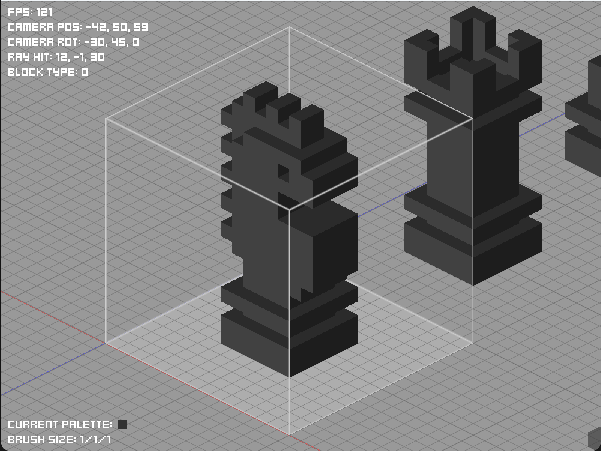
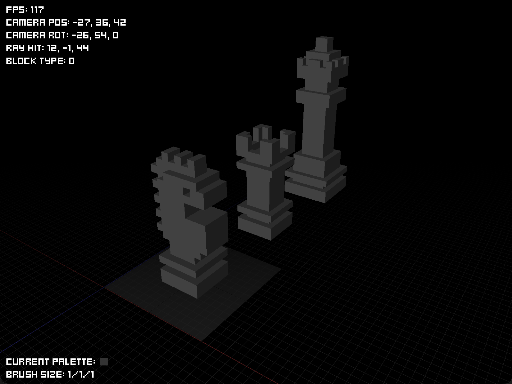

# Voxelly - Voxel Modeling Application in C++/OpenGL

Voxelly is a voxel-based 3D modeling application developed in C++ using OpenGL for rendering. It allows users to create, edit, and visualize voxel models in a 3D environment.

## Features

- Voxel-based modeling with a variety of block types
- Real-time rendering using OpenGL
- User interface for selecting block types and brush sizes (WIP)
- Support for multiple color palettes (WIP)
- Camera controls for navigating the 3D space
- Saving and loading voxel models
- Exporting models to common formats (WIP)
- Cross-platform support (Windows, macOS, Linux, Web) (WIP)

## Getting Started

Currently, Voxelly is in active development, and some features are still a work in progress (WIP). To get started with the application, follow the instructions below for manual compilation and setup.

### Prerequisites

- C++17 compatible compiler (e.g., GCC, Clang, MSVC)
- CMake 3.10 or higher
- OpenGL 3.3 or higher

### Building the Application

1. Clone the repository:
   ```bash
    git clone https://github.com/y3v4d/voxelly.git
    cd voxelly
    ```
2. Run CMake to configure the project:
   ```bash
    mkdir build
    cd build
    cmake ..
    ```
3. Build the project:
   ```bash
    cmake --build .
    ```

4. Run the application:
   ```bash
    ./Voxelly
    ```

## Screenshots


